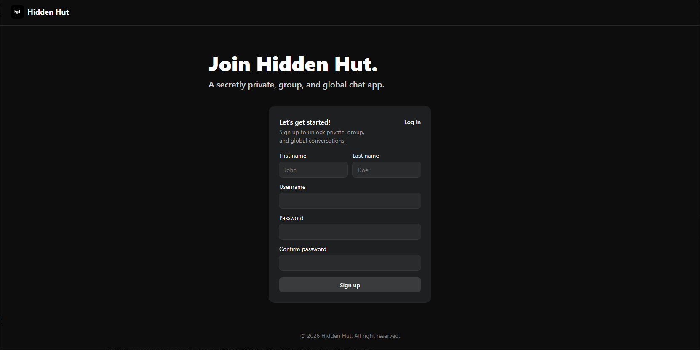
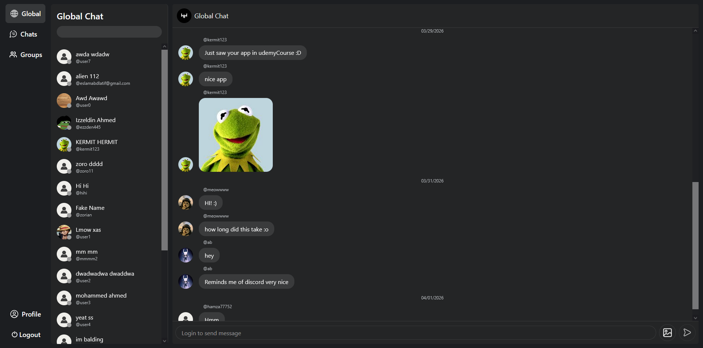

# Messenger App
A full-stack messenger application designed to provide seamless communication.

## Preview
---

### Signup Page

### Global Chat

### User Profile

## Features
---
- User authentication (Log in & Sign up)
- Send and manage text messages
- Image sharing capabilities
- Group creation and management
- User connection and interaction
- Global chat functionality
- Comprehensive account management

## Technologies Used
---
### Frontend
- TypeScript
- React
- Tailwind
- Vite
- Shadcn
- Vercel

### Backend
- Express
- Nodejs
- PostgreSQL
- Prisma
- Cloudinary
- Render
- Neon

## Libraries Used
---
### Frontend
- [react-hook-form](https://react-hook-form.com) – Simplifies form states, errors, and validations.
- [react-router-dom](https://reactrouter.com) – Contains bindings for using React Router in web applications.
- [zod](https://zod.dev) – Schema validation for forms.
- [@tanstack/react-query](https://tanstack.com/query) – Querying requests for better performance.
- [date-fns](https://date-fns.org) – Provides the most comprehensive, yet simple and consistent toolset for manipulating JavaScript dates.
- [react-hot-toast](https://react-hot-toast.com) – Lightweight notification library for displaying success and error messages.

### Backend
- [PassportJS](https://www.passportjs.org) – Authentication middleware for Express.
- [bcryptjs](https://github.com/dcodeIO/bcrypt.js) – For securing passwords by hashing and salting.
- [jsonwebtoken](https://github.com/auth0/node-jsonwebtoken) – A proposed Internet standard for creating data with optional signature and/or optional encryption.
- [dotenv](https://github.com/motdotla/dotenv) – For keeping my database connection strings and API keys secret.
- [cloudinary](https://cloudinary.com) – Used for uploading/storing images.
- [multer](https://github.com/expressjs/multer) – Node.js middleware for handling multipart/form-data, which is primarily used for uploading files.
- [cors](https://github.com/expressjs/cors) – Package for providing a Connect/Express middleware that can be used to enable CORS.